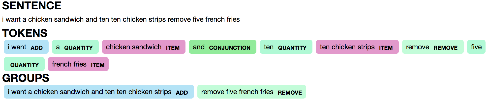
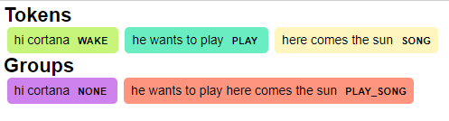

# About
[](https://travis-ci.org/michaelperel/putput)
[](https://codecov.io/gh/michaelperel/putput)
[](https://badge.fury.io/py/putput)
[](https://pypi.org/project/putput/)
[](https://putput.readthedocs.io/en/latest/)
[](https://pypi.org/project/putput/)
[](https://pypi.org/project/putput/)

```putput``` is a library that generates labeled data for conversational AI. It's simple to use, highly customizable, and can handle big data generation on a consumer grade laptop. ```putput``` takes minutes to setup and seconds to generate millions of labeled data points.

```putput```'s labeled data could be used to:
* train a ML model when you do not have real data.
* augment training specific patterns in a ML model.
* test existing ML models for specific patterns.

```putput``` provides an API to its ```Pipeline``` that specifies how to generate labeled data. It ships with presets that configure the ```Pipeline``` for common NLU providers such as [LUIS](https://www.luis.ai/home) and [spaCy](https://spacy.io/). ```putput``` excels at generating custom datasets, even for problems that have yet to be solved commercially and for which no publicly available datasets exist. For instance, checkout this [jupyter notebook](https://nbviewer.jupyter.org/github/michaelperel/putput/blob/70bbda1499461aa8fe1fb642423fce76701ecc2b/samples/restaurant/lstm.ipynb) that uses ```putput``` to generate a dataset for **multi-intent** recognition and trains a LSTM with [Keras](https://keras.io/) to recognize multi-intent and entities.

Here is an example prediction from the LSTM trained with ```putput``` data:



Note that the trained LSTM can deal with real life complexity such as handling multi-intent ("add" and "remove" ```groups```) and disambiguating between the same word in different contexts (the quantity "ten" vs. "ten" in the item "ten chicken strips").

# Installation
```putput``` currently supports python >= 3.5. To install the production release, execute ```pip install putput```.

# Samples
```putput``` ships with several dockerized samples that show how to generate data.

* Clone the repo:
  ```git clone https://github.com/michaelperel/putput.git```
* Move into the project directory:
  ```cd putput```
* Ensure docker is running:
  ```docker --version```
* Build the runtime environment:
  ```docker build -t putput .```
* The project ships with several usage samples which you can execute, for example:
  ```docker run putput smart_speaker``` or ```docker run putput restaurant```.

```putput``` also ships with annotated jupyter notebooks in the ```samples/``` directory that use ```putput``` to solve real world NLU problems. Note: Github cannot correctly render certain graphics, so the notebooks should be viewed on [nbviewer](https://nbviewer.jupyter.org/).

# Development
There are various checks that Travis (our CI server) executes to ensure code quality.
You can also run the checks locally:

1. Install the development dependencies via: ```pip install -e .[dev]```
2. Run the linter: ```python setup.py pylint```
3. Run the type checker: ```python setup.py mypy```
4. Run the tests: ```python setup.py test```

Alternatively, you can run all the steps via Docker: ```docker build --target=build -t putput .```

# Usage
```putput``` is a pipeline that works by reshaping the ```pattern definition```, a user defined yaml file of patterns, into labeled data.

## Example
Here is an example of a ```pattern definition``` that generates labeled data for a smart speaker.
```
base_tokens:
  - PERSONAL_PRONOUNS: [he, she]
  - SPEAKER: [cortana, siri, alexa, google]
token_patterns:
  - static:
    - WAKE:
      - [[hi, hey], SPEAKER]
    - PLAY:
      - [PERSONAL_PRONOUNS, [wants, would like], [to], [play]]
      - [[play]]
  - dynamic:
    - ARTIST
    - SONG
groups:
  - PLAY_SONG: [PLAY, SONG]
  - PLAY_ARTIST: [PLAY, ARTIST]
utterance_patterns:
  - [WAKE, PLAY_SONG]
  - [WAKE, PLAY_ARTIST]
  - [WAKE, 1-2, PLAY_SONG]
```

Focusing on the first ```utterance_pattern```, ```[WAKE, PLAY_SONG]```, ```putput``` would generate hundreds of ```utterances```, ```tokens```, and ```groups``` of the form:

```utterance``` - hi cortana he wants to play here comes the sun



## Pattern definition reference
In the ```pattern definition```, the two most important sections are ```token_patterns``` and ```utterance_patterns```. A ```token_pattern``` describes a sequence of components whose product constitutes a ```token```. For instance, the sole ```token_pattern``` for the ```WAKE``` ```token``` is ```[[hi, hey], [cortana, siri, alexa, google]]``` (the ```base_token```, ```SPEAKER```, is replaced with its value ```[cortana, siri, alexa, google]``` at runtime). The product of this ```token_pattern```:
* hi cortana
* hi siri
* hi alexa
* hi google
* hey cortana
* hey siri
* hey alexa
* hey google

represents the ```WAKE``` ```token```.

Within the ```token_patterns``` section, there are ```static``` and ```dynamic``` sections. ```static``` means all of the ```token_patterns``` can be specified before the application runs. ```dynamic``` means the ```token_patterns``` will be specified at runtime. In our example, ```WAKE``` is defined underneath ```static``` because all ways to awake the smart speaker are known before runtime. ```ARTIST``` and ```SONG```, however, are defined underneath ```dynamic``` because the artists and songs in your music catalog may change frequently. The values for these ```tokens``` can be passed in as arguments to ```Pipeline``` at runtime.

Within each ```token_pattern```, ```base_tokens``` may be used to keep yourself from repeating the same components. For instance, in our example, we could potentially use ```PERSONAL_PRONOUNS``` in many different places, so we'd like to only have to define it once.

An ```utterance_pattern``` describes the product of ```tokens``` that make up an ```utterance```. For instance, the first ```utterance_pattern```, ```[WAKE, PLAY, SONG]```, is a product of all of the products of ```token_patterns``` for ```WAKE```, ```PLAY```, and ```SONG``` (the ```group```, ```PLAY_SONG```, is replaced with its value ```[PLAY, SONG]```). Example ```utterances``` generated from this ```utterance_pattern``` would be:
* hi cortana play here comes the sun
* hi cortana he would like to play here comes the sun

Within each ```utterance_pattern```, ```groups``` may be used to keep yourself from repeating the same ```tokens```. For instance, in our example, we could potentially use ```PLAY_SONG``` in many different places, so we'd like to only have to define it once. Unlike ```base_tokens```, ```putput``` keeps track of ```groups```. For instance, recall one potential output corresponding to the ```utterance_pattern```, ```[WAKE, PLAY_SONG]```:


Since ```PLAY_SONG``` is the only ```group``` in the ```utterance_pattern```, the ```WAKE``` ```token``` is assigned the ```group``` ```NONE``` whereas the ```PLAY``` and ```SONG``` ```tokens``` are assigned the ```group``` ```PLAY_SONG```.

Thinking in terms of commercial NLU providers, ```groups``` could be used to match to ```intents``` and ```tokens``` could be used to match ```entities```.

```utterance_patterns``` and ```groups``` support range syntax. Looking at the last ```utterance_pattern```, ```[WAKE, 1-2, PLAY_SONG]```, we see the range, 1-2. Putput will expand this ```utterance_pattern``` to two ```utterance_patterns```, ```[WAKE, PLAY_SONG]``` and ```[WAKE, WAKE, PLAY_SONG]```. Ranges are inclusive and may also be specified as a single number, which would expand into one ```utterance_pattern```.

Finally, ```groups``` may be defined within ```groups```. For instance: 
```
- groups:
  - PLAY_SONG: [PLAY, SONG]
  - WAKE_PLAY_SONG: [WAKE, PLAY_SONG, 10]
```
is valid syntax.

## Pipeline
After defining the ```pattern definition```, the final step to generating labeled data is instantiating ```putput```'s ```Pipeline``` and calling ```flow```.
```
dynamic_token_patterns_map = {
    'SONG': ((('here comes the sun', 'stronger'),),),
    'ARTIST': ((('the beatles', 'kanye west'),),)
}
p = Pipeline(pattern_def_path, dynamic_token_patterns_map=dynamic_token_patterns_map)
for utterance, tokens, groups in p.flow():
    print(utterance)
    print(tokens)
    print(groups)
```
```flow``` yields results one ```utterance``` at a time. While the results could be the tuple ```(utterance, tokens, groups)``` for each iteration, they could also be customized by specifying arguments to ```Pipeline```. Some common use cases are limiting the size of the output, oversampling/undersampling ```utterance_patterns```, specifying how ```tokens``` and ```groups``` are tokenized, etc. Customization of the ```Pipeline``` is extensive and is covered in the ```Pipeline```'s [docs](https://putput.readthedocs.io/en/latest/source/putput.html). Common ```preset``` configurations are covered in the ```preset``` [docs](https://putput.readthedocs.io/en/latest/source/putput.presets.html).
